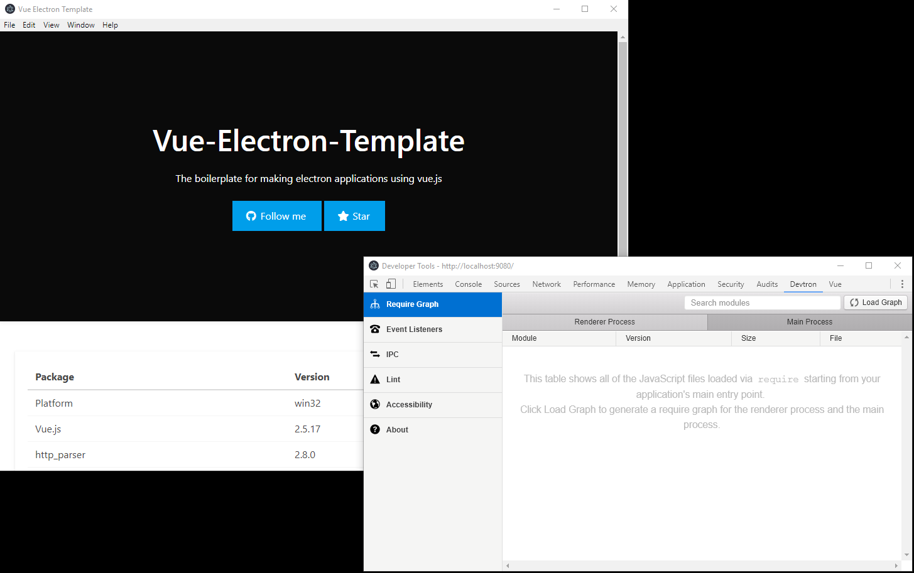

<p align="center"></p>

# Vue-Electron-Template

[](https://travis-ci.org/mubaidr/vue-electron-template)
[](https://ci.appveyor.com/project/mubaidr/vue-electron-template)
[](#contributors)

Template for building desktop applications using [Electronjs](https://electronjs.org) and [Vue.js](https://vuejs.org)

## Overview

This template takes advantage of `webpack-4` with `vue-loader`, `electron-builder`, and some of the most used plugins like `vue-router`, `vuex` and so much more to provide an easy to use development (with vscode debugging) enviroment with hot module replacement.

### Features

- [Bulma-Pro](https://mubaidr.github.io/bulma-pro/), a theme suitable for desktop application based on [Bulma](https://bulma.io/)
- [vue-router](https://github.com/vuejs/vue-router)
- [vuex](https://github.com/vuejs/vuex)
- [vue-electron](https://github.com/SimulatedGREG/vue-electron)
- [material-design-icons](http://google.github.io/material-design-icons/) installed
- Some built-in animaitons [animations.scss](src\renderer\assets\style\animations.scss)
- `SCSS`/`SASS` support with [vue-loader](https://github.com/vuejs/vue-loader/) (removes unused css/styles during build)
- `Typescript` support
- Worker scripts (to perform CPU-intensive operations), to use with nodejs `child_process` module. [Sample Worker File](src\utilities\workerSample.ts)
- Easily package your electron app using [electron-builder](https://github.com/electron-userland/electron-builder)
- Installed [vue-devtools](https://github.com/vuejs/vue-devtools) and [devtron](https://github.com/electron/devtron) tools for development
- `DEV`, `DEBUG` & `BUILD` NPM scripts
- `--debug` paramter to enable dev tools in build executeable
- `Babel` configured
- `ESLint` configured
- `vscode` debug config for renderer process debugging
- Process restarting when working in main process & hot module replacement for renderer.

### Screenshot

<p align="center"></p>

### Getting Started

Clone this repository, install dependencies and run using either `dev`, `debug` or `build` command.

```bash
# Clone this repository
git clone https://github.com/mubaidr/vue-electron

# change directory to cloned path
cd vue-electron

# Install dependencies
npm install

# Run in `debug` mode, to debug app using VSCODE
npm run debug

# Run in `dev` mode
npm run dev

# Build installer for this app
npm run build
```

### Project structure

`src/main` contains electron main script.

`src/renderer` contains vue-js application.

`src/utilities/workerSample.ts` a sample worker script.

#### Credits

All credits to authors of packages and tools used in the project.

\* This template is inspired by [electron-vue](https://github.com/SimulatedGREG/electron-vue)

## Contributors

Thanks goes to these wonderful people ([emoji key](https://github.com/all-contributors/all-contributors#emoji-key)):

<!-- ALL-CONTRIBUTORS-LIST:START - Do not remove or modify this section -->
<!-- prettier-ignore -->
| [<br /><sub><b>Jibbie R. Eguna</b></sub>](https://github.com/jbeguna04)<br />[🎨](#design-jbeguna04 "Design") |
| :---: |

<!-- ALL-CONTRIBUTORS-LIST:END -->

This project follows the [all-contributors](https://github.com/all-contributors/all-contributors) specification. Contributions of any kind welcome!
